## 🌸 깨끗한 꽃놀이 (Clean Cherry Blossom)

### 서울시 벚꽃 개화시기 및 올바른 쓰레기 버리기 문화를 위한 쓰레기통 위치를 알려주는 웹서비스

- 개요
  - 벚꽃 개화시기가 도래함에 따라 많은 관광지가 활성화될 것으로 예상됨 이에 서울시 내의 벚꽃 명소들의 벚꽃 개화시기를 화면상에 표시하고, 관광지에 사람이 몰려들수록 무분별하게 버려지는 쓰레기가 많아진다는 자료를 참고해 서울시에 존재하는 쓰레기통의 위치를 알려줄 수 있는 웹 사이트를 제작하려고 함. 쓰레기통의 위치는 초기 제작자가 데이터를 넣어두지만, 사용자의 제보에 의해 삭제/추가될 수 있음. 추후 지역 및 장소는 추가 예정
- 필요기능

  - 회원기능
    - 로그인
    - 회원가입
    - 임시 비밀번호 발급
    - SNS(구글, 네이버) 로그인 구현
  - 지도
    - 쓰레기통의 위치를 마커로 표시
      - 공공데이터포털의 지역구별 “쓰레기통설치현황” 정보를 기반으로 위치정보 획득
    - 지역별 섹터를 나누어 꽃의 예상 개화시기를 알려줌
      - 인터넷 검색을 통한 정보 취합 후 신뢰성 높은 정보를 채택
  - 관리자 페이지
    - 회원관리
    - 쓰레기통, 꽃 개화시기 제보 수렴

- 계획 (총 40일)
  - 회원기능 (5일)
  - 클라이언트 페이지 제작(14일)
  - 백엔드 엔드포인트 및 비즈니스 로직 제작 (14일)
  - 테스트 및 디버그, 배포 (7일)

## Stacks 📚

#### Environment

<span>
    
    
    
    
</span>

#### Package Manager


#### Backend

<span>
    
    
    
    
    
</span>

#### Frontend

<span>
    
    
    
    
    
</span>

## Screen configuration 📺

| Main                                              |
| ------------------------------------------------- |
| 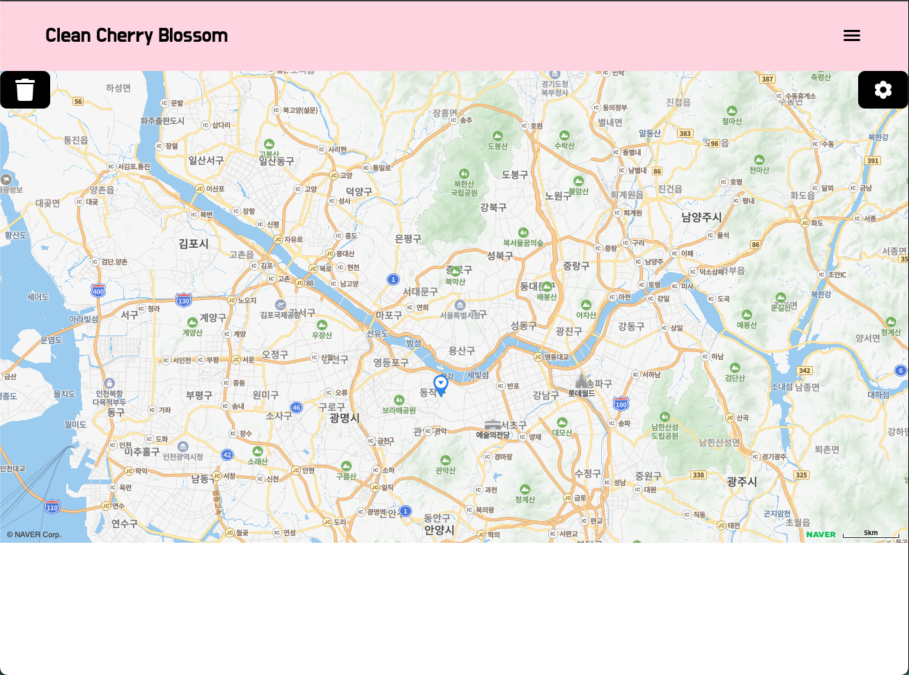 |
| 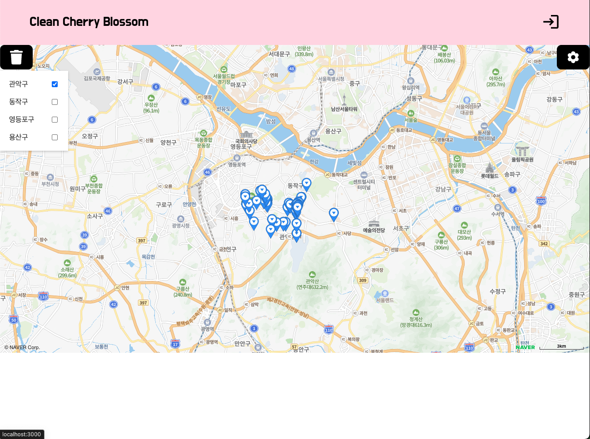 |
| 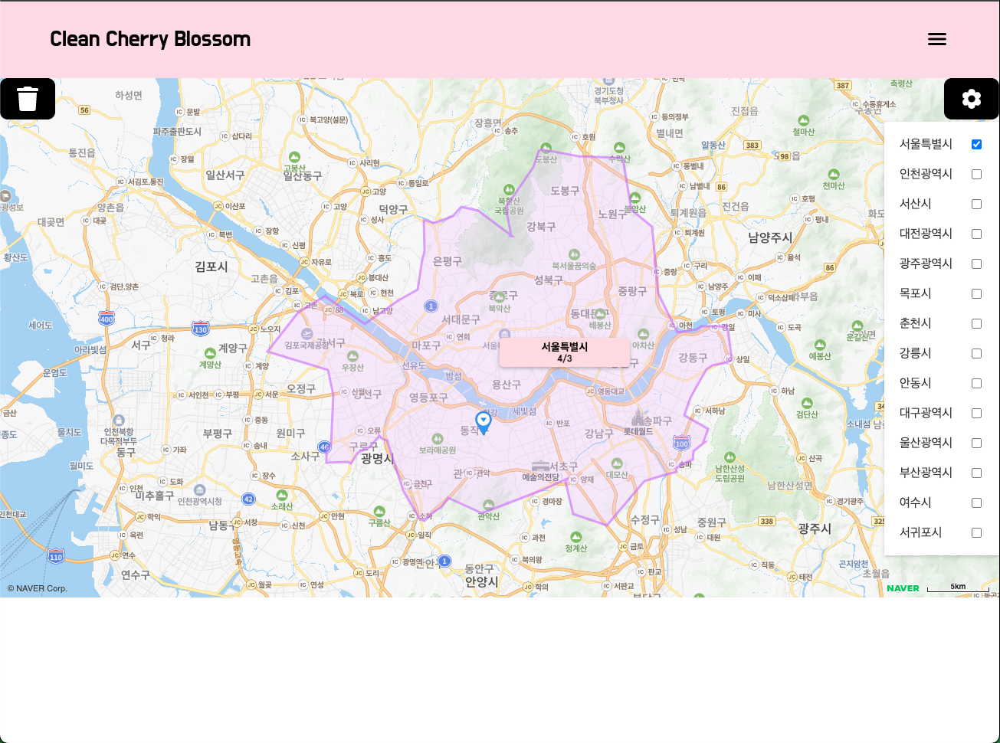 |

| Login                                             |
| ------------------------------------------------- |
| 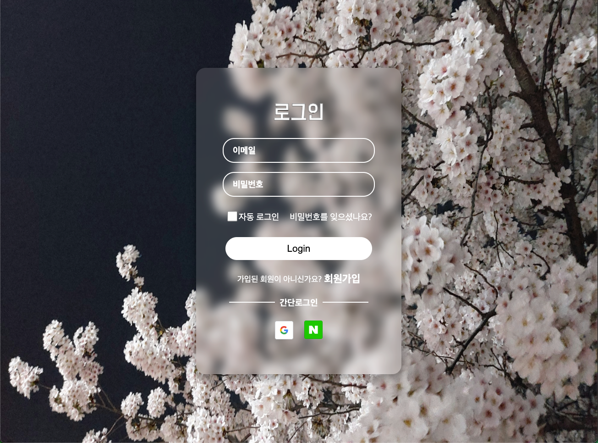 |

| Register                                              |
| ----------------------------------------------------- |
| 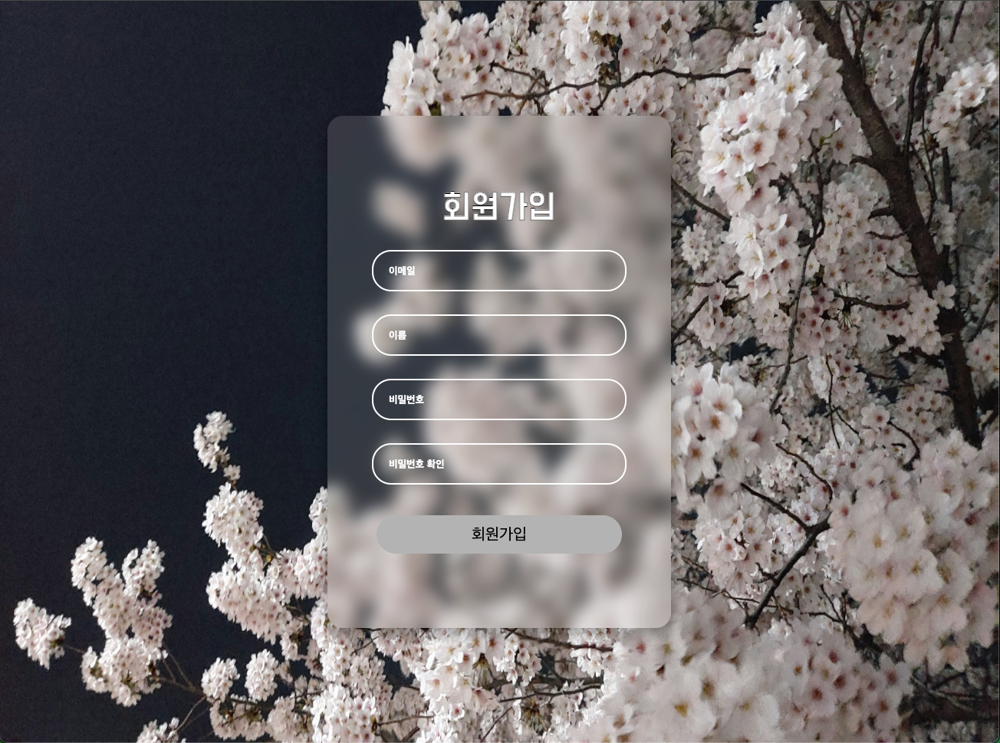 |
| 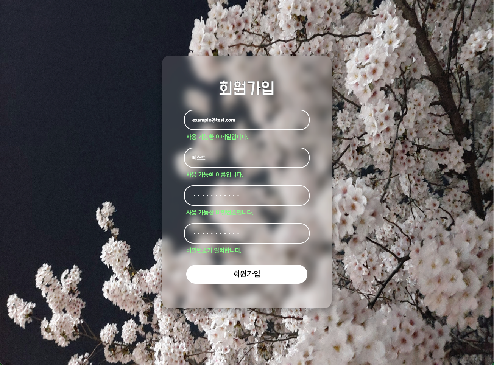 |

| User Info                                             |
| ----------------------------------------------------- |
| 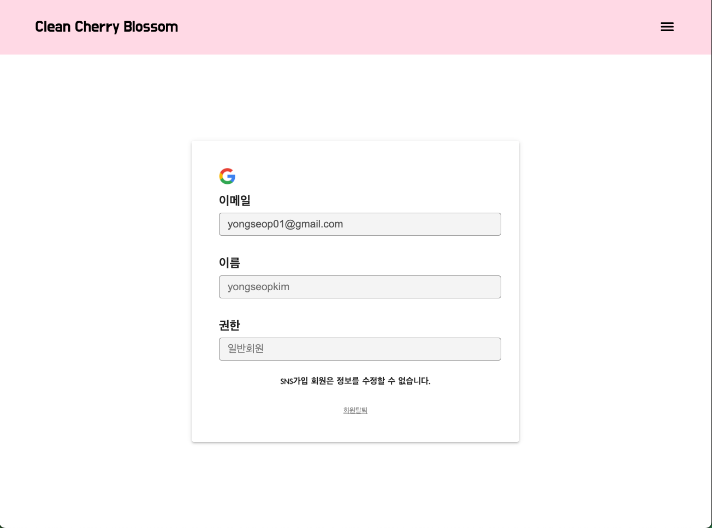 |
| 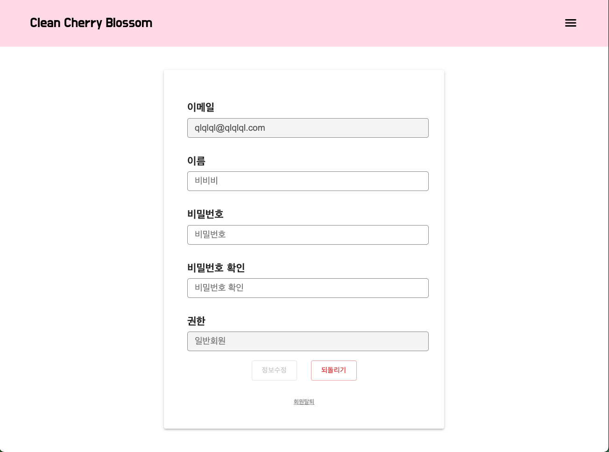 |
| 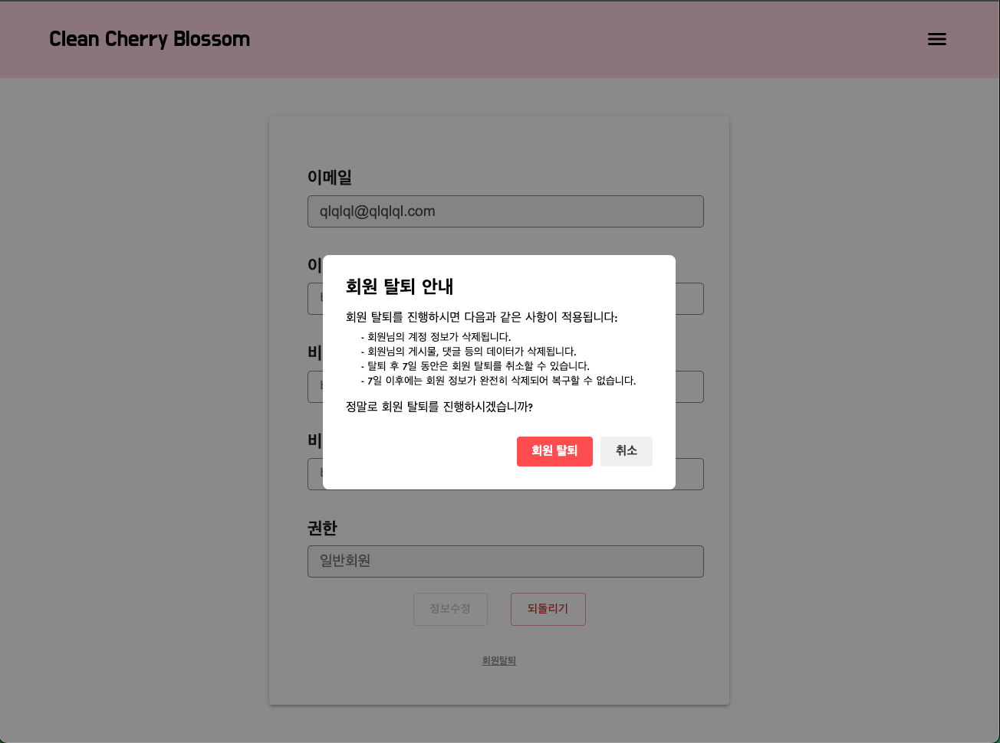 |

| Report List                                        |
| -------------------------------------------------- |
| 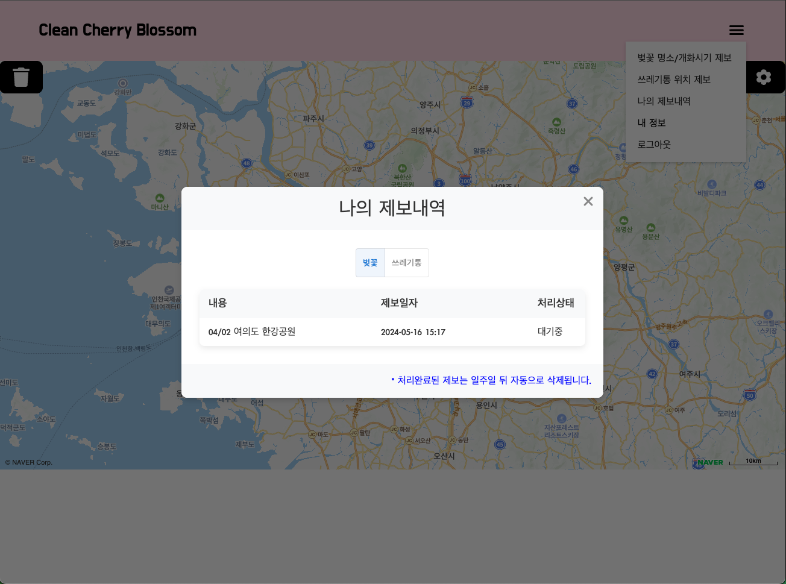 |

| Report Modal                                        |
| --------------------------------------------------- |
| 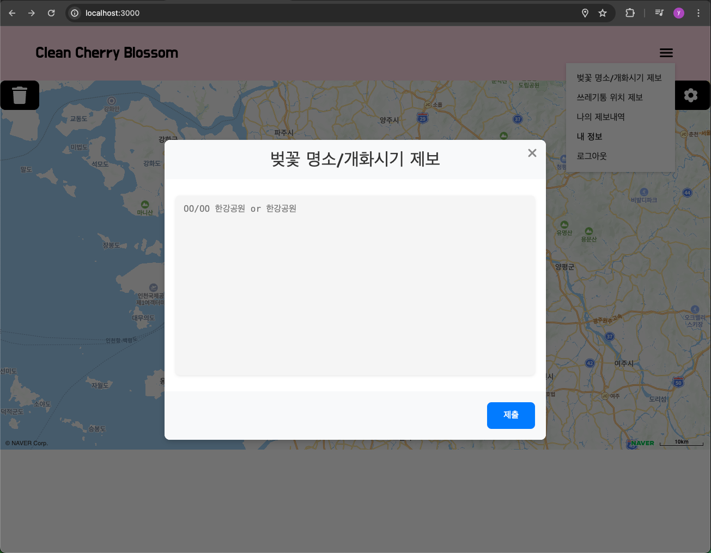 |
| 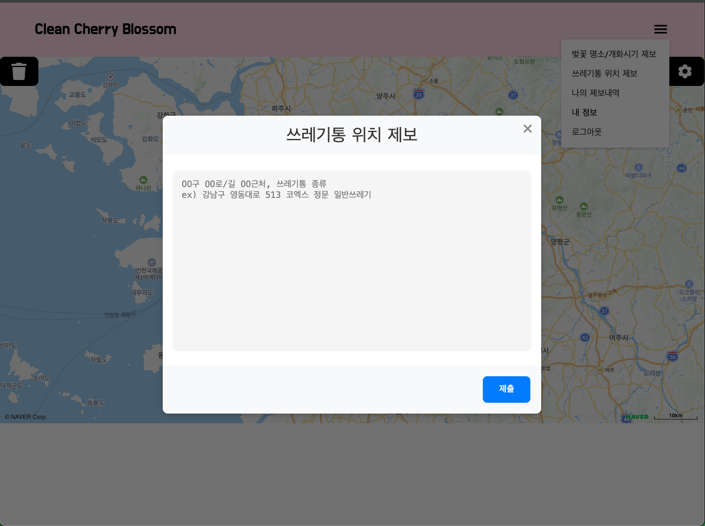 |

| Admin Page                                              |
| ------------------------------------------------------- |
| 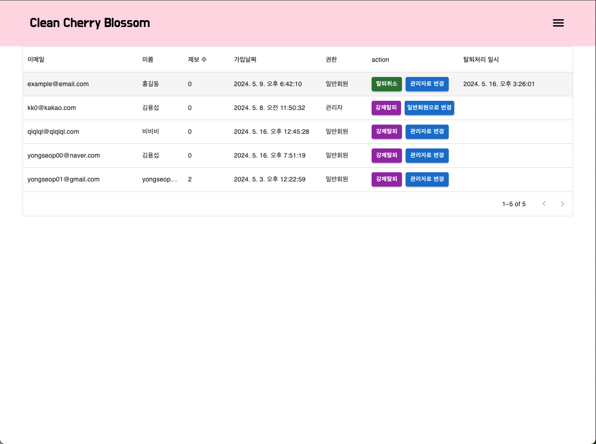 |
| 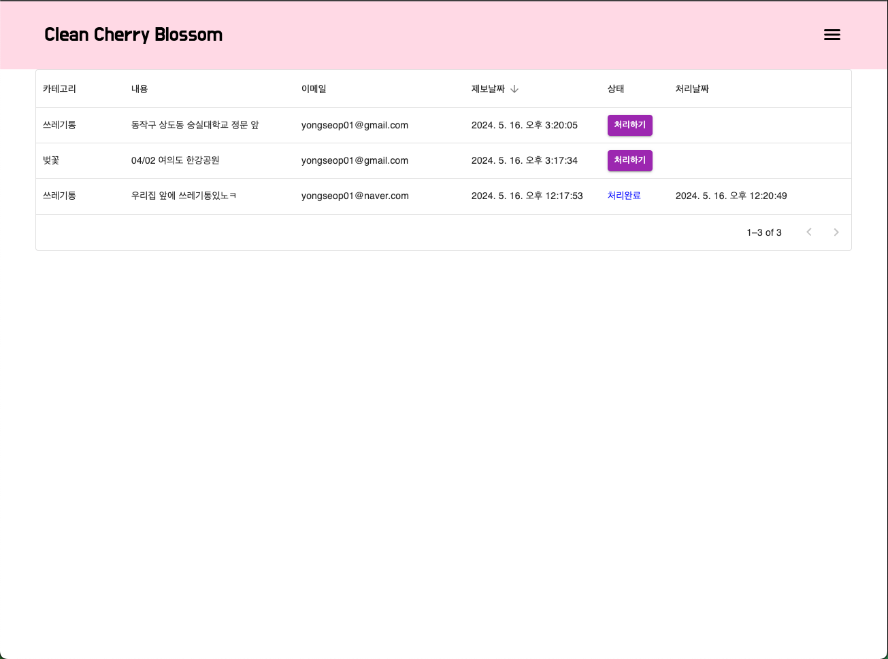 |

## Project Structure 🌲

```
cherry-blossom-clean-react
├─ .eslintrc.cjs
├─ .gitignore
├─ README.md
├─ index.html
├─ package-lock.json
├─ package.json
├─ public
│  ├─ fonts
│  │  └─ DoHyeon-Regular.ttf
│  ├─ images
│  │  ├─ googleLogin.png
│  │  ├─ kakaoLogin.png
│  │  ├─ memberBackground.jpg
│  │  ├─ mobile-member-background.jpeg
│  │  ├─ naverlogo.png
│  │  └─ trash-icon.png
│  └─ vite.svg
├─ src
│  ├─ App.css
│  ├─ App.jsx
│  ├─ assets
│  │  ├─ boundary
│  │  │  ├─ andongBoundary.json
│  │  │  ├─ busanBoundary.json
│  │  │  ├─ chuncheonBoundary.json
│  │  │  ├─ daeguBoundary.json
│  │  │  ├─ daejeonBoundary.json
│  │  │  ├─ gangneungBoundary.json
│  │  │  ├─ gwangjuBoundary.json
│  │  │  ├─ incheonBoundary.json
│  │  │  ├─ mokpoBoundary.json
│  │  │  ├─ seogwipoBoundary.json
│  │  │  ├─ seosanBoundary.json
│  │  │  ├─ seoulBoundary.json
│  │  │  ├─ ulsanBoundary.json
│  │  │  └─ yeosuBoundary.json
│  │  └─ react.svg
│  ├─ components
│  │  ├─ blossom-map
│  │  │  ├─ jsx
│  │  │  │  ├─ AdminMemberManagement.jsx
│  │  │  │  ├─ AdminReportList.jsx
│  │  │  │  ├─ CustomOverlay.jsx
│  │  │  │  └─ MapTemplate.jsx
│  │  │  └─ scss
│  │  │     ├─ AdminMemberManagement.scss
│  │  │     ├─ AdminReportList.scss
│  │  │     └─ MapTemplate.scss
│  │  ├─ layout
│  │  │  ├─ jsx
│  │  │  │  ├─ Dropdown.jsx
│  │  │  │  ├─ ErrorPage.jsx
│  │  │  │  ├─ Header.jsx
│  │  │  │  ├─ Modal.jsx
│  │  │  │  ├─ MyInfo.jsx
│  │  │  │  └─ Skeleton.jsx
│  │  │  └─ scss
│  │  │     ├─ Dropdown.scss
│  │  │     ├─ ErrorPage.scss
│  │  │     ├─ Header.scss
│  │  │     ├─ Modal.scss
│  │  │     ├─ MyInfo.scss
│  │  │     └─ WithdrawalModal.scss
│  │  └─ member
│  │     ├─ jsx
│  │     │  ├─ ForgetPassword.jsx
│  │     │  ├─ GoogleLoginComponent.jsx
│  │     │  ├─ Login.jsx
│  │     │  ├─ NaverLogin.jsx
│  │     │  ├─ NaverLoginComponent.jsx
│  │     │  └─ Resister.jsx
│  │     └─ scss
│  │        ├─ Login.scss
│  │        └─ Register.scss
│  ├─ config
│  ├─ index.css
│  ├─ main.jsx
│  └─ util
│     └─ login-util.jsx
└─ vite.config.js
```
